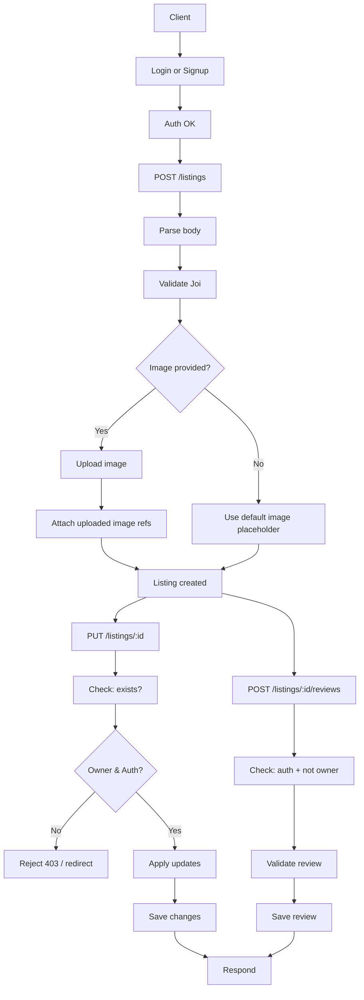

# commercial-home-rent — README


Modern, compact README tailored to the Express + EJS property-listing code in this repository. Items marked [VERIFY] come from the source and should be confirmed before production use.

## Table of Contents

- **[Project intro](#project-intro)**
- **[Project structure](#project-structure)**
- **[Differentiators](#differentiators)**
- **[Features](#features)**
- **[Tech stack](#tech-stack)**
- **[Install methods](#install-methods)**
  - [npm / Node](#npm--node)
  - [Docker](#docker)
- **[Format selection & upload syntax](#format-selection--upload-syntax)**
- **[Database structure](#json-metadata-example)**
- **[Contributing](#contributing)**
- **[License](#license)**

<a id="project-intro"></a>
## 🚀 Project intro

`commercial-home-rent` is a compact Express application that implements listings, reviews, and user authentication. It is intended as a learning or MVP foundation for property listing and renting functionality. The application uses server-side templates (EJS) and stores data in MongoDB.

<a id="project-structure"></a>
## 📁 Project structure

```
wanderlust-ecommerce-app/
├── models/            # Mongoose models
├── routes/            # Express route handlers
├── views/             # EJS templates
├── public/            # Static assets (CSS, JS, images)
├── controllers/       # Controller logic
├── app.js             # Main application entry point
├── .env               # Environment variables
├── README.md
└── ...
```

Key routes (based on `app.js`):

- `/` — user routes (signup/login) handled by `routes/user.js`
- `/listings` — listing routes handled by `routes/listing.js`
- `/listings/:id/reviews` — reviews handled by `routes/review.js`

<a id="differentiators"></a>
## ⭐ Differentiators

- Clear MVC-like separation (models/controllers/routes) in a small codebase.
- `passport-local-mongoose` simplifies user model and authentication.
- Joi validation in `schema.js` provides central request validation.
- Cloudinary integration for image storage (optional).

<a id="features"></a>
## 🔧 Features

### Core features

| Feature | Status | Notes |
|---------|:------:|-------|
| User registration & login | Current | Passport Local (session-based auth) |
| Listings CRUD | Current | Create, read, update, delete listings |
| Listing update ownership guard | Current | Update only if: listing exists, user authenticated, user is owner |
| Reviews (create/delete) | Current | Authenticated users can add/remove their reviews |
| Session storage (MongoDB) | Current | `connect-mongo` |
| Flash messages & error handling | Current | Centralized Express error middleware |
| Cloud image uploads | Current | Multer + Cloudinary (optional) |

### Extended / Optional

| Feature | Status | Notes |
|---------|:------:|-------|
| Docker support | Example | Sample Dockerfile included |
| Payments | Future | Stripe / PayPal integration planned |
| Favorites / Wishlists | Future | User personalization |
| Reviews & Ratings enhancements | Future | Owner / renter feedback workflow |

### Listing update authorization

Update (PUT/PATCH) is permitted only if all conditions hold:
1. Listing exists (404 if not).
2. User is logged in (redirect/login if not).
3. Authenticated user `_id` matches listing `owner` (403 otherwise).

### User review option

- Authenticated users can post one review per listing (enforce uniqueness in controller/model if desired).
- Conditions:
  1. Listing exists.
  2. User authenticated.
  3. (Optional) Prevent user from reviewing own listing.
- Delete review allowed only for its author (and optionally admins).

<a id="tech-stack"></a>
## 🧰 Tech stack

- Node.js (see `package.json`. `engines` field contains Node 23.5.0 — prefer an LTS version in production) [VERIFY]
- Express
- EJS + ejs-mate
- MongoDB + Mongoose
- Passport.js + passport-local-mongoose
- Joi for validation
- Cloudinary + multer-storage-cloudinary for image uploads

<a id="install-methods"></a>
## ⚙️ Install methods

This is a Node.js application. Pip/pipx are not applicable.


<a id="npm--node"></a>
### 📦 npm / Node

Install via `npm install` and start with `node app.js`. Note: `package.json` contains other scripts (Vite) but the server runs from `app.js`.


```powershell
git clone <repo-url> commercial-home-rent
cd commercial-home-rent
npm install
node app.js
# for development with auto-reload
nodemon app.js
```


<a id="docker"></a>
### 🐳 Docker

Example Dockerfile:

```dockerfile
FROM node:20-alpine
WORKDIR /app
COPY package*.json ./
RUN npm ci --production
COPY . .
ENV NODE_ENV=production
EXPOSE 8080
CMD ["node", "app.js"]
```

Build and run:

```powershell
docker build -t commercial-home-rent:latest .
docker run -p 8080:8080 -e ATLASDB_URL="..." -e SECRET="..." commercial-home-rent:latest
```

Create a `.env` at the project root with these variables (example):

```properties
ATLASDB_URL=mongodb+srv://<user>:<pass>@cluster.example.mongodb.net/dbname
SECRET=some-session-secret
CLOUD_NAME=...
CLOUD_API_KEY=...
CLOUD_API_SECRET=...
MAP_TOKEN=... # optional
```


Note: `app.js` loads `.env` automatically when NODE_ENV != "production".

<a id="format-selection--upload-syntax"></a>
## 🗂 Format selection & upload syntax

- `schema.js` defines the expected request payload shapes for listings and reviews.
- `cloudConfig.js` contains Cloudinary params; the source includes a probable typo `allowerdFormats` — correct to `allowedFormats` if you depend on that option. [VERIFY]

Listing Joi validation fields:

- `listing.title` (string, required)
- `listing.description` (string, required)
- `listing.location` (string, required)
- `listing.country` (string, required)
- `listing.price` (number >= 0, required)
- `listing.image` (string | null)

Review fields:

- `review.rating` (number 1..5)
- `review.comment` (string)

Mermaid flow (updated: default image used when none uploaded):



<a id="json-metadata-example"></a>
## 🗄️Database structure

MongoDB collections and representative document shapes.

### users collection
```json
{
  "_id": "ObjectId",
  "username": "string",
  "email": "string",
  "hash": "string",       // managed by passport-local-mongoose
  "salt": "string",       // managed internally
  "createdAt": "Date",
  "updatedAt": "Date"
}
```

### listings collection
```json
{
  "_id": "ObjectId",
  "title": "string",
  "description": "string",
  "location": "string",
  "country": "string",
  "price": 3500,
  "image": {
    "url": "string",              // uploaded or default placeholder
    "filename": "string"          // Cloudinary public_id (optional)
  },
  "owner": "ObjectId -> users._id",
  "reviews": ["ObjectId -> reviews._id"],
  "createdAt": "Date",
  "updatedAt": "Date"
}
```

### reviews collection
```json
{
  "_id": "ObjectId",
  "rating": 1,
  "comment": "string",
  "author": "ObjectId -> users._id",
  "listing": "ObjectId -> listings._id",
  "createdAt": "Date",
  "updatedAt": "Date"
}
```

### Relationships
- listing.owner references users.
- listing.reviews is an array of review ids.
- review.author references users.
- review.listing references listings.
- Delete listing: cascade (manually) delete its reviews.
- Delete user: decide whether to restrict if user owns listings/reviews (not automatic).

### Index suggestions
- users: { username: 1 } unique.
- listings: { owner: 1, createdAt: -1 }.
- reviews: { listing: 1, author: 1 } unique compound (enforces one review per user per listing).

### Default image logic
If no upload provided, set image.url to a constant (e.g. /images/default-listing.jpg) and image.filename to null.

<a id="contributing"></a>
## 🤝 Contributing

- Fork the repo, create a branch, open a PR.
- Keep PRs small and include verification steps.
- Never commit secrets; use `.env` for local configuration.

<a id="license"></a>
## 📜 License

MIT — add a `LICENSE` file to make this explicit.


